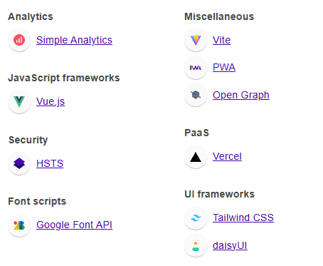

# Vue 3 + Vite Starter Template

This template is a solid foundation to build Vue 3 apps quickly using Vite. It includes:

* **Vue 3** with `<script setup>` SFCs for a clean and modern syntax.
* **Vite** for lightning-fast dev server and build.
* **Vitest** for components unit testing (the official Vitest).
* **Vue-I18n** for components Localization (the official).
* **Tailwind CSS** + **DaisyUI** for utility-first styling and prebuilt UI components.
* **Pinia** for state management (the official Vue store).
* **Vue Router** for SPA routing with dynamic routes and navigation guards.
* **PWA** support with installable app capabilities for a native-like experience.
* **ESLint** configured for consistent code style and quality.
* **Husky** with pre-commit hooks for automated code linting and unit testing.
* **Bundle Analyzer** for inspecting and optimizing bundle size.
* **SEO** automatically generating a sitemap.xml, helping search engines crawl site routes efficiently.

---

## Getting Started

### Prerequisites

* Node.js & npm

### Install dependencies

```bash
npm install
```

### Run development server

```bash
npm run dev
```

Open your browser to start coding.

### Build for production

```bash
npm run build
```

## ESLint & Formatting
* Vue 3 specific rules enabled
* Supports autofixing on save in editors like VSCode

## Tech



## Performance


## Contributing
Feel free to open issues or pull requests to improve the template!
